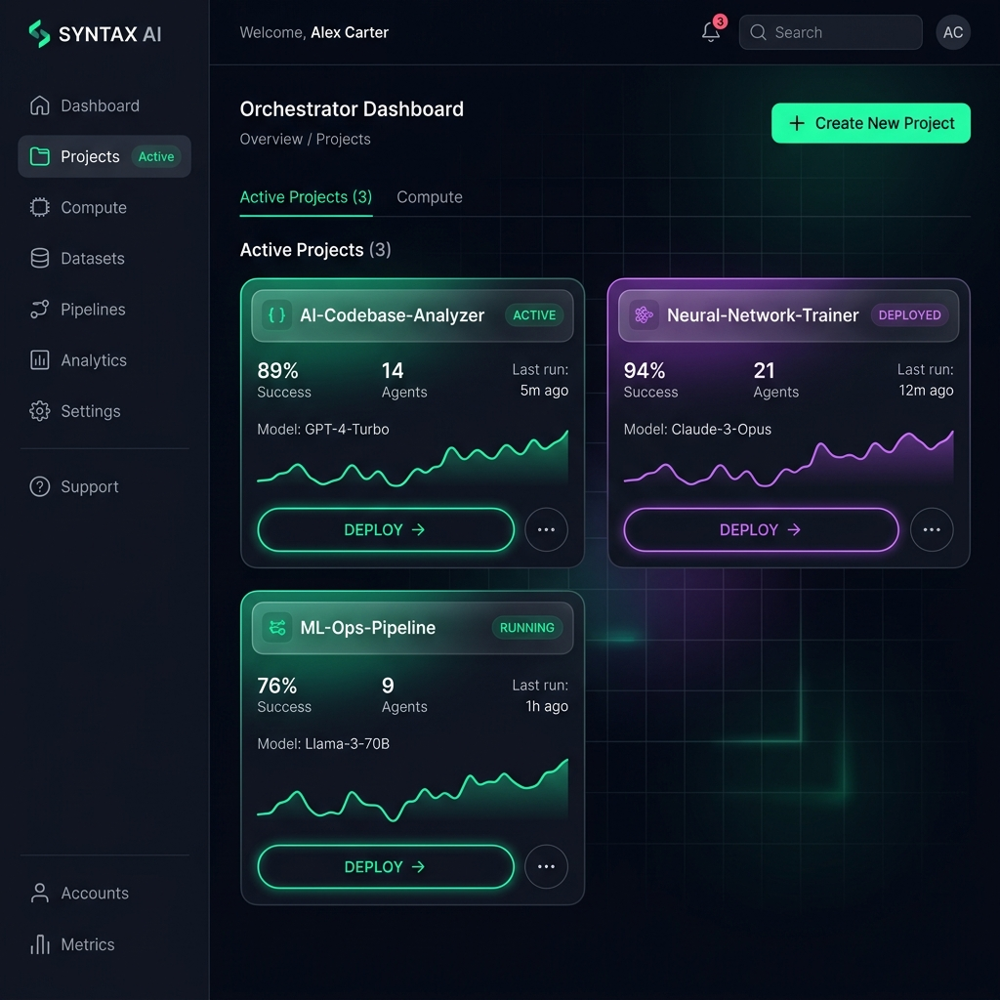

# 🚀 Orquestador VibeCoding



Bienvenido al **Orquestador VibeCoding**, el panel de control maestro definitivo para configurar, gestionar y desplegar entornos de desarrollo de Inteligencia Artificial hiper-avanzados. Basado en **Oh My OpenAgent + OpenCode GO**, esta plataforma local (SPA) centraliza múltiples proveedores, gestiona cuentas, controla rate-limits, monitorea costos financieros y equipa a tus agentes con un arsenal de Skills y Servidores MCP.

Más que un simple gestor, es una herramienta diseñada para el desarrollo **Agentic** y **VibeCoding**: el arte de programar a la velocidad del pensamiento orquestando a múltiples IA para que escriban, prueben y desplieguen código por ti.

---

## ✨ Características Premium (Core)

*   **Multi-Proveedor y Bypass de Rate Limits**: Configura múltiples proveedores (OpenCode Go, OpenRouter, Xiaomi MiMo, Ollama Cloud) y múltiples cuentas por proveedor (ej. `opencode-go-1`, `opencode-go-2`). El orquestador implementa un sistema de **Fallbacks y Ruteo Inteligente**; si la cuenta primaria agota sus créditos o da error (ej. `429 Too Many Requests`), salta inmediatamente a la secundaria o a un proveedor de respaldo de forma transparente.
*   **Gestor de Cuentas Avanzado**: Administra visualmente tus claves API (`sk-...`) y subscripciones (`tp-...`). Incluye un test inteligente de un clic que verifica tus saldos e inyecta la URL base correcta según tu tipo de llave.
*   **Dashboard Visual y Tracking Financiero**: Un motor de proxy local intercepta eventos *Server-Sent Events (SSE)* para contar cada token de entrada (prompt) y salida (completion). Su sección de Métricas (Chart.js) grafica tus costos en USD y te desglosa cuánto dinero y tokens ha gastado cada agente y cada modelo.
*   **Orquestación de 11 Agentes (OmO)**: Configura reglas estrictas para los agentes de *Oh My OpenAgent* (Ej. Usar DeepSeek V4 para la arquitectura, Qwen 3 Coder para programar, y Kimi para los tests unitarios).

---

## 🛠️ El Arsenal: Skills y Servidores MCP

El verdadero poder del Orquestador VibeCoding radica en su capacidad para inyectar "Superpoderes" (Skills y Model Context Protocol) directamente en tus entornos de trabajo.

### 🎭 Modificadores de Comportamiento (Skills)
*   **UI/UX Pro Max**: Transforma al agente en un diseñador senior. Lo obliga a usar CSS avanzado, glassmorphism, micro-animaciones y paletas vibrantes.
*   **Ponytail**: El asistente minimalista. Le prohíbe emitir saludos, disculpas o explicaciones; solo entrega el código crudo necesario para resolver el problema.
*   **Caveman**: Lleva la concisión al extremo, eliminando palabras de transición para reducir el consumo de tokens en más de un 70%, sin perder precisión técnica.
*   **Token Optimizer**: Funciona en segundo plano purgando los "tokens fantasma" (información irrelevante o muerta) de la ventana de contexto del agente. Previene que el agente alucine y decaiga en calidad durante sesiones de programación muy largas.

### 🔌 Servidores del Sistema (MCPs)
*   **Codebase-Memory MCP**: Motor hiperveloz escrito en Go que indexa tu repositorio usando Árboles de Sintaxis Abstracta (AST). Permite al agente buscar funciones, rastrear dependencias y leer el mapa de la arquitectura a velocidades absurdas.
*   **Engram MCP**: Dota al agente de memoria a largo plazo. A diferencia de un chatbot normal que olvida todo, Engram le permite escribir y leer notas, recordatorios y decisiones arquitectónicas que persisten para siempre.
*   **Spec-Kit**: Habilita el *Spec-Driven Development* (Desarrollo Guiado por Especificaciones), forzando al agente a validar pruebas y reglas de negocio antes de tocar el código base.
*   **GitHub MCP (Extreme Security)**: Integración oficial y transparente con GitHub. Podrás leer Issues y hacer Pull Requests desde la IA. **Arquitectura de Cero Almacenamiento**: Al ingresar tu token de GitHub en el panel web, el Orquestador lo inyecta efímeramente directo en tu `~/.bashrc` y lo destruye de la memoria de la aplicación, garantizando que tus credenciales nunca sean guardadas en disco.

---

## 🤖 Mantenimiento Autónomo (Auto-Update Git Hook)

El orquestador no solo crea tu entorno, sino que **lo mantiene vivo**. 
Al desplegar o actualizar un proyecto desde la plataforma web, el backend inyectará silenciosamente un script **Git Hook (`post-merge`)** en la carpeta `.git` de tu repositorio. 

**¿Qué significa esto?** 
Que cada vez que abras tu terminal y ejecutes `git pull` para traerte código nuevo, el ecosistema entero se actualizará en segundo plano. Herramientas como npm, uv, y Go actualizarán de manera invisible todos tus Skills (Caveman, Ponytail) y servidores (Engram, GitHub MCP) a su versión más reciente. Tu IA nunca se quedará obsoleta.

---

## 🚀 Instalación en tu Máquina Virtual (Linux)

Cuando levantes una nueva Máquina Virtual (Ubuntu/Debian) o entorno de desarrollo:

### Paso 1: Clonar e Instalar
```bash
sudo apt update && sudo apt install -y git curl

# Clonar el proyecto
git clone https://github.com/christer88/orquestador-vibecoding.git
cd orquestador-vibecoding

# Instalar Node.js v20+ (si no está instalado)
curl -fsSL https://deb.nodesource.com/setup_22.x | sudo bash -
sudo apt install -y nodejs

# Instalar dependencias
npm install
```

### Paso 2: Arrancar y Persistir el Servidor
```bash
# Instalar PM2 para correr el orquestador en segundo plano (daemon)
sudo npm install -g pm2

# Levantar la plataforma web
npx pm2 start server.js --name orquestador

# Persistir el orquestador ante reinicios del sistema operativo
npx pm2 save
npx pm2 startup
```

La interfaz web estará lista en el puerto `3847`. Visita `http://localhost:3847` o la IP de tu VM.

---

## 💻 Flujo de Trabajo

1.  **Cuentas**: Añade tus API Keys en la pestaña *Cuentas y Claves*.
2.  **Wizard**: Crea un nuevo proyecto y selecciona tus Cuentas, Agentes, Skills y Fallbacks.
3.  **Desplegar**: Presiona "Desplegar". El Orquestador inyectará las credenciales y el Git Hook de auto-update en tu carpeta local.
4.  **VibeCoding**: Entra a tu carpeta de proyecto y escribe `bunx oh-my-opencode`. El agente estará equipado, ruteado, perfilado (como un diseñador o un cavernícola) y con sus memorias (Engram/Codebase) listas para servirte.

> **Tip de Supervivencia**: Si añades una nueva API Key manual en el archivo `.env`, recuerda reiniciar PM2 para recargar las variables del sistema operativo (`npx pm2 restart orquestador --update-env`).

---

## 🔄 Actualización y Solución de Problemas (Troubleshooting)

### Cómo actualizar el Orquestador desde GitHub
Si subimos nuevas características al repositorio, puedes actualizar tu instalación local sin perder tus configuraciones ni bases de datos (están protegidas por `.gitignore`):

```bash
cd ~/orquestador-vibecoding
git pull origin main
npm install
```

### 🔴 Evitar que la versión vieja quede pegada en memoria
Si actualizas el código, cambias llaves manuales en el `.env`, o restauras un backup, y notas que el sistema sigue comportándose con la configuración antigua (ej. dando Error 401 por una API Key vieja), **el problema es la memoria caché de PM2**. 

Node.js no sobrescribe variables de entorno ya cargadas en memoria, por lo que un simple reinicio a veces no basta. Para forzar una recarga totalmente limpia y matar la versión vieja, ejecuta:

```bash
npx pm2 delete orquestador
npx pm2 start server.js --name orquestador
npx pm2 save
```

¡Bienvenido a la programación del futuro!
